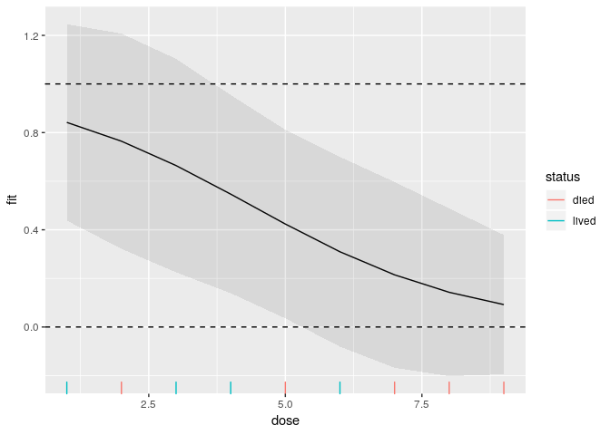

# Predictions in generalized linear models

ideas taken from (this blog
post)\[<https://www.fromthebottomoftheheap.net/2018/12/10/confidence-intervals-for-glms/>\]

## packages

``` r
library(tidyverse) # for ggplot
```

    ## ── Attaching packages ───────────────────────────────────────────────────────────────────────────────────────────── tidyverse 1.2.1 ──

    ## ✔ ggplot2 3.1.1          ✔ purrr   0.3.2     
    ## ✔ tibble  2.1.1          ✔ dplyr   0.8.0.1   
    ## ✔ tidyr   0.8.3.9000     ✔ stringr 1.4.0     
    ## ✔ readr   1.3.1          ✔ forcats 0.3.0

    ## Warning: package 'ggplot2' was built under R version 3.5.3

    ## Warning: package 'tibble' was built under R version 3.5.3

    ## Warning: package 'tidyr' was built under R version 3.5.3

    ## Warning: package 'readr' was built under R version 3.5.2

    ## Warning: package 'purrr' was built under R version 3.5.3

    ## Warning: package 'dplyr' was built under R version 3.5.2

    ## Warning: package 'stringr' was built under R version 3.5.2

    ## Warning: package 'forcats' was built under R version 3.5.1

    ## ── Conflicts ──────────────────────────────────────────────────────────────────────────────────────────────── tidyverse_conflicts() ──
    ## ✖ dplyr::filter() masks stats::filter()
    ## ✖ dplyr::lag()    masks stats::lag()

## Some made-up data

``` r
d=tribble(
  ~dose, ~status,
  1, "lived",
  2, "died",
  3, "lived",
  4, "lived",
  5, "died",
  6, "lived",
  7, "died",
  8, "died",
  9, "died"
)
d
```

    ## # A tibble: 9 x 2
    ##    dose status
    ##   <dbl> <chr> 
    ## 1     1 lived 
    ## 2     2 died  
    ## 3     3 lived 
    ## 4     4 lived 
    ## 5     5 died  
    ## 6     6 lived 
    ## 7     7 died  
    ## 8     8 died  
    ## 9     9 died

Logistic regression requires a “factor” for response (not a text
variable). There are several ways to create one, eg:

``` r
factor(d$status)
```

    ## [1] lived died  lived lived died  lived died  died  died 
    ## Levels: died lived

This puts the levels into alphabetical order.

``` r
fct_inorder(d$status)
```

    ## [1] lived died  lived lived died  lived died  died  died 
    ## Levels: lived died

This puts the levels into the order they appear in the data.

I use the first way for the logistic regression below.

## fit logistic regression

``` r
d.1=glm(factor(status)~dose, family="binomial", data=d)
summary(d.1)
```

    ## 
    ## Call:
    ## glm(formula = factor(status) ~ dose, family = "binomial", data = d)
    ## 
    ## Deviance Residuals: 
    ##     Min       1Q   Median       3Q      Max  
    ## -1.7004  -0.6951  -0.4398   0.9046   1.5315  
    ## 
    ## Coefficients:
    ##             Estimate Std. Error z value Pr(>|z|)
    ## (Intercept)   2.1669     1.8275   1.186    0.236
    ## dose         -0.4949     0.3523  -1.405    0.160
    ## 
    ## (Dispersion parameter for binomial family taken to be 1)
    ## 
    ##     Null deviance: 12.3653  on 8  degrees of freedom
    ## Residual deviance:  9.6944  on 7  degrees of freedom
    ## AIC: 13.694
    ## 
    ## Number of Fisher Scoring iterations: 4

probability of *living* goes down as dose goes up

## predictions (for the observed doses)

``` r
p=predict(d.1)
cbind(d, p)
```

    ##   dose status          p
    ## 1    1  lived  1.6720321
    ## 2    2   died  1.1771300
    ## 3    3  lived  0.6822279
    ## 4    4  lived  0.1873258
    ## 5    5   died -0.3075763
    ## 6    6  lived -0.8024784
    ## 7    7   died -1.2973805
    ## 8    8   died -1.7922826
    ## 9    9   died -2.2871847

these are predicted log-odds of living (on the linear predictor scale).

Can make it into predicted probabilities:

``` r
p=predict(d.1, type="response")
p
```

    ##         1         2         3         4         5         6         7 
    ## 0.8418466 0.7644314 0.6642358 0.5466950 0.4237065 0.3094956 0.2146062 
    ##         8         9 
    ## 0.1427931 0.0921899

``` r
cbind(d,p)
```

    ##   dose status         p
    ## 1    1  lived 0.8418466
    ## 2    2   died 0.7644314
    ## 3    3  lived 0.6642358
    ## 4    4  lived 0.5466950
    ## 5    5   died 0.4237065
    ## 6    6  lived 0.3094956
    ## 7    7   died 0.2146062
    ## 8    8   died 0.1427931
    ## 9    9   died 0.0921899

Can also get standard errors:

``` r
p=predict(d.1, type="response", se.fit = T)
p
```

    ## $fit
    ##         1         2         3         4         5         6         7 
    ## 0.8418466 0.7644314 0.6642358 0.5466950 0.4237065 0.3094956 0.2146062 
    ##         8         9 
    ## 0.1427931 0.0921899 
    ## 
    ## $se.fit
    ##         1         2         3         4         5         6         7 
    ## 0.2019855 0.2213942 0.2196344 0.2038066 0.1939846 0.1951861 0.1911006 
    ##         8         9 
    ## 0.1724557 0.1433258 
    ## 
    ## $residual.scale
    ## [1] 1

``` r
cbind(d,p) -> preds
preds
```

    ##   dose status       fit    se.fit residual.scale
    ## 1    1  lived 0.8418466 0.2019855              1
    ## 2    2   died 0.7644314 0.2213942              1
    ## 3    3  lived 0.6642358 0.2196344              1
    ## 4    4  lived 0.5466950 0.2038066              1
    ## 5    5   died 0.4237065 0.1939846              1
    ## 6    6  lived 0.3094956 0.1951861              1
    ## 7    7   died 0.2146062 0.1911006              1
    ## 8    8   died 0.1427931 0.1724557              1
    ## 9    9   died 0.0921899 0.1433258              1

Obvious thing, plus/minus twice the SE, makes no sense here:

``` r
preds %>% mutate(lo=fit-2*se.fit, hi=fit+2*se.fit) -> preds2
preds2
```

    ##   dose status       fit    se.fit residual.scale          lo        hi
    ## 1    1  lived 0.8418466 0.2019855              1  0.43787564 1.2458175
    ## 2    2   died 0.7644314 0.2213942              1  0.32164306 1.2072197
    ## 3    3  lived 0.6642358 0.2196344              1  0.22496687 1.1035047
    ## 4    4  lived 0.5466950 0.2038066              1  0.13908186 0.9543081
    ## 5    5   died 0.4237065 0.1939846              1  0.03573729 0.8116756
    ## 6    6  lived 0.3094956 0.1951861              1 -0.08087664 0.6998679
    ## 7    7   died 0.2146062 0.1911006              1 -0.16759493 0.5968073
    ## 8    8   died 0.1427931 0.1724557              1 -0.20211835 0.4877046
    ## 9    9   died 0.0921899 0.1433258              1 -0.19446163 0.3788414

The CIs for the predicted probabilities go below 0 and above 1, which
makes no sense.

plot predicted probs

``` r
g <- ggplot(preds, aes(x = dose, y = fit)) +
    geom_line()
g
```

<!-- -->

add wrong ci limits as ribbon

``` r
g + geom_ribbon(data = preds2, aes(ymin = lo, ymax = hi),
                  alpha = 0.1) +
  geom_hline(yintercept=1, linetype="dashed")+
  geom_hline(yintercept=0, linetype="dashed")
```

<!-- -->

This shows how the confidence limits make no sense (outside the dashed
lines).

## Doing it better

Work with *linear predictor*, and then invert it

``` r
p=predict(d.1, se.fit=T)
cbind(d, p) %>% 
  mutate(lo=fit-2*se.fit, hi=fit+2*se.fit) -> preds3
preds3
```

    ##   dose status        fit    se.fit residual.scale        lo        hi
    ## 1    1  lived  1.6720321 1.5170802              1 -1.362128 4.7061926
    ## 2    2   died  1.1771300 1.2294482              1 -1.281766 3.6360263
    ## 3    3  lived  0.6822279 0.9847903              1 -1.287353 2.6518086
    ## 4    4  lived  0.1873258 0.8223990              1 -1.457472 1.8321238
    ## 5    5   died -0.3075763 0.7944350              1 -1.896446 1.2812938
    ## 6    6  lived -0.8024784 0.9133306              1 -2.629140 1.0241828
    ## 7    7   died -1.2973805 1.1337890              1 -3.564958 0.9701975
    ## 8    8   died -1.7922826 1.4089148              1 -4.610112 1.0255471
    ## 9    9   died -2.2871847 1.7125605              1 -5.712306 1.1379363

getting the inverse link function

``` r
fam=family(d.1)
str(fam)
```

    ## List of 12
    ##  $ family    : chr "binomial"
    ##  $ link      : chr "logit"
    ##  $ linkfun   :function (mu)  
    ##  $ linkinv   :function (eta)  
    ##  $ variance  :function (mu)  
    ##  $ dev.resids:function (y, mu, wt)  
    ##  $ aic       :function (y, n, mu, wt, dev)  
    ##  $ mu.eta    :function (eta)  
    ##  $ initialize:  expression({  if (NCOL(y) == 1) {  if (is.factor(y))  y <- y != levels(y)[1L]  n <- rep.int(1, nobs)  y[weights =| __truncated__
    ##  $ validmu   :function (mu)  
    ##  $ valideta  :function (eta)  
    ##  $ simulate  :function (object, nsim)  
    ##  - attr(*, "class")= chr "family"

there is a function `linkinv` that we can grab:

``` r
inv_link=fam$linkinv
inv_link(0)
```

    ## [1] 0.5

``` r
inv_link(1)
```

    ## [1] 0.7310586

``` r
inv_link(-1)
```

    ## [1] 0.2689414

These values make sense.

Work out inverse logit of predictions and hi and
    lo

``` r
preds3
```

    ##   dose status        fit    se.fit residual.scale        lo        hi
    ## 1    1  lived  1.6720321 1.5170802              1 -1.362128 4.7061926
    ## 2    2   died  1.1771300 1.2294482              1 -1.281766 3.6360263
    ## 3    3  lived  0.6822279 0.9847903              1 -1.287353 2.6518086
    ## 4    4  lived  0.1873258 0.8223990              1 -1.457472 1.8321238
    ## 5    5   died -0.3075763 0.7944350              1 -1.896446 1.2812938
    ## 6    6  lived -0.8024784 0.9133306              1 -2.629140 1.0241828
    ## 7    7   died -1.2973805 1.1337890              1 -3.564958 0.9701975
    ## 8    8   died -1.7922826 1.4089148              1 -4.610112 1.0255471
    ## 9    9   died -2.2871847 1.7125605              1 -5.712306 1.1379363

``` r
preds3 %>% mutate(fit=inv_link(fit),
                  lo=inv_link(lo),
                  hi=inv_link(hi)) -> preds4
preds4
```

    ##   dose status       fit    se.fit residual.scale          lo        hi
    ## 1    1  lived 0.8418466 1.5170802              1 0.203894612 0.9910418
    ## 2    2   died 0.7644314 1.2294482              1 0.217249714 0.9743200
    ## 3    3  lived 0.6642358 0.9847903              1 0.216301229 0.9341224
    ## 4    4  lived 0.5466950 0.8223990              1 0.188854267 0.8620145
    ## 5    5   died 0.4237065 0.7944350              1 0.130511213 0.7826699
    ## 6    6  lived 0.3094956 0.9133306              1 0.067286431 0.7357866
    ## 7    7   died 0.2146062 1.1337890              1 0.027519414 0.7251589
    ## 8    8   died 0.1427931 1.4089148              1 0.009852661 0.7360517
    ## 9    9   died 0.0921899 1.7125605              1 0.003294156 0.7573005

``` r
g + geom_ribbon(data = preds4, aes(ymin = lo, ymax = hi),
                  alpha = 0.1) +
  geom_hline(yintercept=1, linetype="dashed")+
  geom_hline(yintercept=0, linetype="dashed")
```

<!-- -->

Now the confidence intervals stay between 0 and 1. Note that the actual
predictions are no longer in the middle of their intervals.
